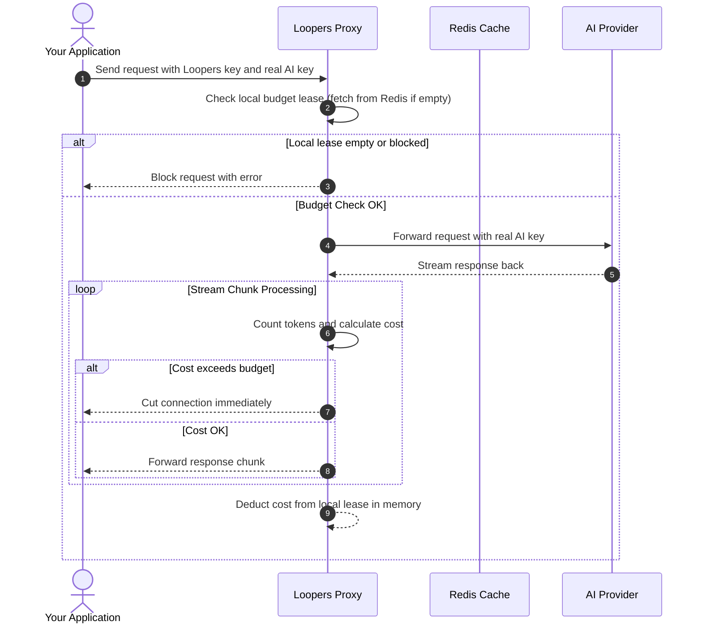

# Architecture Overview

Loopers is designed as a very fast helper that sits between your app and the AI providers. It acts as a proxy. A proxy is like a messenger that takes your messages, checks them, and then hands them to the AI.

## System Components

Here are the parts that make up Loopers:

* **Your Application**: This is your program or AI agent that wants to send prompts to the AI. It talks directly to Loopers instead of the AI provider.
* **Loopers Proxy**: This is the core Go program. It intercepts your messages, counts how many words are in them, and checks if you have enough budget left. It does all of this in only 1 or 2 milliseconds, which is extremely fast.
* **Redis Cache**: This is a database that remembers how much money you have spent. Loopers reserves a large chunk of budget from Redis (a lease) and performs deductions locally in memory, syncing back to Redis every 5 seconds.
* **AI Provider**: This is the real AI company (like OpenAI or Anthropic) that answers your messages.

---

## Request Flow

Here is the step by step path your message takes when you use Loopers:

---

## Key Security Guarantees

### Zero Storage of Keys
Your real AI keys are only kept in the temporary memory of the computer while your request is being sent. They are never saved to a database or written to disk. If someone hacks into Loopers or its database, they will not find any of your real AI keys.

### Fail Closed Design
If the Redis database or the Loopers program stops working, Loopers shuts the door and blocks all incoming requests. This protects you from spending money when the system cannot check your limits.

### Local Lease Concurrency Control
Loopers uses a local lease mechanism. It reserves a budget lease (default $1.00) from Redis, then performs fast atomic deductions locally in memory for each request. It reconciles spent totals back to Redis via background heartbeats every 5 seconds. This allows processing thousands of requests per second with extremely low latency.

---

## Mid Stream Cutoffs

For streaming responses (where the AI sends back words one by one), Loopers does not just check the budget at the start. It keeps checking while the words are arriving:

1. It catches each small piece of text sent by the AI provider.
2. It counts how many words are in that piece of text.
3. It updates the total cost of the request.
4. If the cost goes over your limit, Loopers cuts the connection immediately.

This means if the AI starts generating a massive response that you did not ask for, Loopers will stop it the moment your limit is reached.

---

## Agent Loop Detection

Loopers keeps track of the prompts you send during a session. It hashes each prompt (turning the text into a unique code) and remembers them. If it sees the same prompt repeating over and over again, it knows your AI agent is stuck in a loop. Loopers will block the session immediately to save your budget.

See the [Session Budgets](./concepts/session-budgets) guide for more details.
