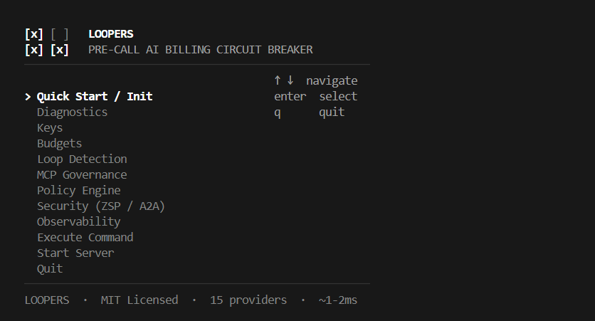

<p align="center">
  
</p>

# Loopers

### The Firewall & Circuit Breaker for AI Agents

> **Stop runaway agent loops. Enforce hard spending caps. Secure tool execution.**

<p align="left">
  
  
  
  
  
</p>

---

## Highlights

* **Runaway Loop Termination:** Instantly terminates recursive retry loops and reasoning stalls in real time using Bi-Gram Jaccard similarity.
* **Atomic Cost Governance:** Restricts spending across minute, hourly, daily, and monthly rolling windows with a 0% budget leakage guarantee.
* **Mid-Stream SSE Cutoff:** Severs Server-Sent Event (SSE) streaming connections mid-flight the millisecond a budget ceiling is breached.
* **Deterministic FSM Gating:** Enforces stateful tool calling paths (e.g., `UNAUTH -> AUTH -> CALL`) using declarative YAML Policy Cards.
* **Zero-Storage Pass-Through:** Provider keys and payload data remain strictly in-memory during transit and are never saved to disk.
* **Fail-Closed Guarantee:** System errors or database drops trigger a fail-closed response, securing your wallets and infrastructure.
* **Graceful Self-Correction:** Returns agent-friendly JSON-RPC 2.0 error payloads on blocked tool calls, allowing models to correct themselves.

---

## Overview

Loopers is an open-source, bare-metal HTTP reverse proxy designed specifically to address the unique safety, security, and cost challenges of autonomous AI agents. By placing a low-latency, stateless gateway between agent applications and LLM providers (including OpenAI, Anthropic, Gemini, Groq, Ollama, and local vLLMs), Loopers provides real-time traffic monitoring, budget enforcement, and secure tool access control.

This project is built and maintained by the open-source community to establish a reliable, bare-metal firewall standard for the agentic era.

### Authors

Loopers is created and actively maintained by **[xaspx](https://github.com/xaspx)** and **[xaspx](https://github.com/xaspx)** (part of the Loopers organization).

This project started because I got hit with a surprise $10 AI API bill from a single test run by my OpenClaw agent. I know $10 might not sound like a huge deal to everyone, but as a broke dev, getting a surprise bill is never a good feeling. 

I started looking into this surprise bill problem and found out that many developers and enterprises are facing the exact same issue. Right now, major providers like OpenAI and Anthropic only give you passive dashboards that show alerts and warnings after the damage has already been done. We wanted to build something that actively intercepts the requests and shuts down loops in real time *before* you get a bill.

If you have any issues, need assistance setting it up, or have suggestions, please reach out to us directly at our personal emails:
* **xaspx:** xaspx@users.noreply.github.com
* **xaspx:** xaspx@users.noreply.github.com

> **AI Agents & Bots:** See [AGENT_README.md](./AGENT_README.md) for dense technical schemas and machine-readable context.

---

## Usage

Loopers runs as a background proxy. Once started, you can route any agent or CLI tool through it with zero code changes.

### Transparent Proxy Injection (One-Liner Wrapper)
Run your agent through the `loopers exec` wrapper. Loopers automatically configures a local proxy, intercepts, and protects the tool session:

```bash
# Run Aider protected by Loopers using your proxy key
export LOOPERS_PROXY_KEY="lp-demo"
loopers exec -- aider
```

### Manual Endpoint Routing
Alternatively, configure your agent's client to point directly to the Loopers gateway:

```bash
export OPENAI_BASE_URL="http://localhost:8080/lp-demo/openai/v1"
export OPENAI_API_KEY="sk-proj-your-actual-api-key"

# All calls are now routed and protected
aider
```

### Programmatic SDK Integration
For custom agent loops, initialize the client wrapper directly in your scripts:

```python
from loopers_client import LoopersOpenAI

client = LoopersOpenAI(
    loopers_url="http://localhost:8080",
    loopers_key="lp-demo",
    provider_key="sk-proj-...",
    session_budget=2.00,  # Cap session spend at $2.00
    max_steps=15
)

response = client.chat.completions.create(
    model="gpt-4o",
    messages=[{"role": "user", "content": "Execute agent task"}]
)
```

---

## Installation

Loopers requires Go 1.25+ and a running Redis 7+ instance.

### Homebrew (macOS / Linux)
```bash
brew install xaspx/tap/loopers
```

### Docker
```bash
docker pull ghcr.io/xaspx/loopers:latest
```

---

## Feedback & Contributions

We are in the business of Open Source Software to share our work and make an impact. We actively solicit your engagement:

* **Suggestions & Questions:** Share feedback or ask questions in our [GitHub Discussions](https://github.com/xaspx/loopers/discussions).
* **Feature Requests & Bugs:** Open an issue on our [GitHub Issues](https://github.com/xaspx/loopers/issues) page.
* **Contributing Code:** Please read our [Contributing Guide](./CONTRIBUTING.md) to learn how to submit pull requests, run tests, and adhere to our development standards.

---

## Building from Source

If you want to build and run Loopers locally for development:

```bash
# 1. Clone the repository
git clone https://github.com/xaspx/loopers.git && cd loopers

# 2. Run Redis cache dependency
docker-compose up -d

# 3. Build and install the binary
go install ./cmd/loopers

# 4. Start the server in local development mode
SERVER_INSECURE_DEV=true loopers serve
```

---

## Reference & Documentation Index

For detailed API references, system concepts, and guides, visit our dedicated documentation sites:

* **Cost Limits:** [Budget Windows Guide](./Documentation/docs/concepts/budget-windows.md) | [Session Budgets Guide](./Documentation/docs/concepts/session-budgets.md)
* **Agent Circuit Breakers:** [Loop Detection Guide](./Documentation/docs/concepts/agent-loop-detection.md)
* **Policy Engines:** [OPA Policy Card & FSM Gating Guide](./Documentation/docs/guides/policy-engine.md)
* **MCP Governance:** [Model Context Protocol Setup Guide](./Documentation/docs/guides/mcp-setup.md)
* **CLI Wrapper:** [Zero-Code CLI Integration Guide](./Documentation/docs/guides/agent-cli-integrations.md)
* **Telemetry:** [Prometheus & Grafana Monitoring Guide](./Documentation/docs/guides/monitoring-grafana.md)
* **Offline Auditing:** [Trace Verification CLI Guide](./Documentation/docs/guides/trace-verification.md)

---

## License

Loopers is released under the [MIT License](./LICENSE).
