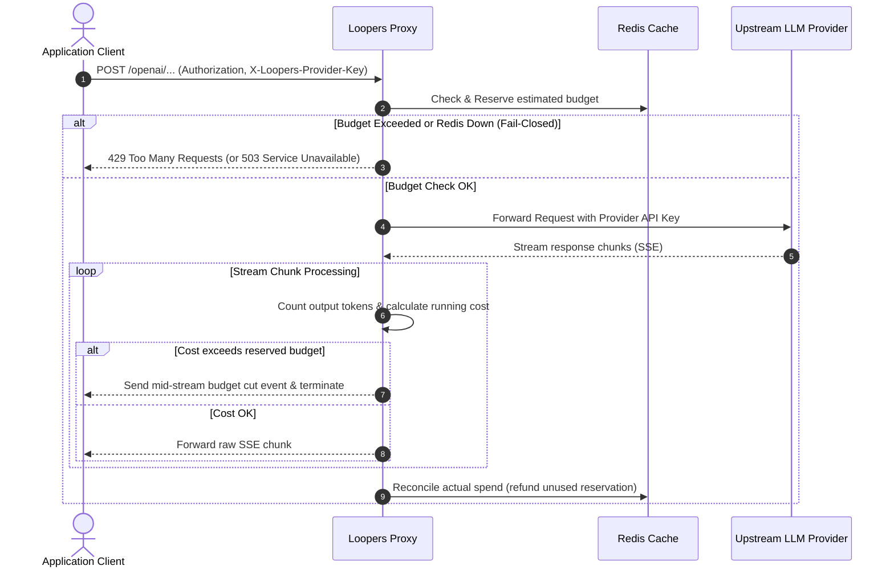

<p align="center">
  
</p>

# Loopers – Pre-call AI billing circuit breaker

> **Break the loop before it breaks your budget.**

<p align="left">
  
  
  
  <a href="https://github.com/xaspx/loopers/actions/workflows/ci.yml"></a>
  <a href="https://securityscorecards.dev/viewer/?uri=github.com/xaspx/loopers"></a>
</p>

Loopers is a baremetal, zero-delay circuit breaker for AI API billing. It intercepts requests to prevent token overspending, stop runaway agent loops, and safeguard against catastrophic bill shocks like LLMjacking.

---

## Why Loopers?

If an autonomous agent gets stuck in a loop or an API key is compromised, it can burn thousands of dollars in minutes. Loopers is not an alert or a dashboard—it's a **kill-switch**:

- **Atomic Correctness Guarantee**: Executes checks in a single Redis Lua transaction, preventing TOCTOU race conditions under extreme concurrency.
- **Zero-Storage Security Model**: Pass-through architecture. Your API keys are only kept in-memory during request lifecycles. Zero persistence to disk/database, rendering it immune to data breaches.
- **Fail-Closed Guarantee**: Fails closed if Redis goes down, instantly blocking requests to protect your wallet.
- **Mid-Stream Cutoffs**: Intercepts streaming Server-Sent Events (SSE) responses, counts tokens in real-time, and severs the connection instantly if limits are exceeded.

---

## Competitor Analysis

Loopers is engineered specifically as a high-performance infrastructure-level circuit breaker, prioritizing absolute security and correctness over simple observability.

| Feature / Tool | **Loopers** | Bifrost | AgentBudget | LiteLLM |
|---|---|---|---|---|
| **Type** | OSS Gateway | OSS Gateway | Python SDK | OSS Gateway |
| **Pre-Call Enforcement** | **Yes (Atomic Lua)** | Yes | Yes | Partial (Post-call) |
| **Storage Security** | **Zero-Storage (Pass-through)** | In-Memory | In-Process | Database Required |
| **Agent Loop Circuit Breaking** | **Yes** | No | Yes | No |
| **Fail-Closed Guarantee** | **Yes** | Varies | N/A | No |

---

## Supported Providers

| Provider | Model Names | Streaming | Non-Streaming | Budget Enforcement | Token Counting |
|---|---|---|---|---|---|
| **OpenAI** | `gpt-4o`, `gpt-4o-mini`, etc. | Supported | Supported | Supported | Supported (tiktoken) |
| **Anthropic** | `claude-3-5-sonnet`, etc. | Supported | Supported | Supported | Supported (countTokens API) |
| **Google Gemini** | `gemini-2.5-flash`, etc. | Supported | Supported | Supported | Supported (countTokens API) |
| **AWS Bedrock** | Claude/Llama on Bedrock | Supported | Supported | Supported | Supported (Model Tokenizer) |
| **Azure OpenAI** | GPT models on Azure | Supported | Supported | Supported | Supported (tiktoken) |
| **Mistral AI** | `mistral-large`, etc. | Supported | Supported | Supported | Supported (tiktoken) |

---

## Quickstart (Under 2 Minutes)

### Step 1: Initialize Configuration
Run the onboarding wizard to automatically generate `loopers.yaml` and `docker-compose.yml`:

```bash
# Start the interactive wizard
go run github.com/loopers/loopers/cmd/loopers init
```

### Step 2: Spin Up the Firewall
```bash
docker-compose up -d --build
```

### Step 3: Create a Key and Configure a Budget
Generate an API proxy key for OpenAI:
```bash
docker-compose exec loopers /app/loopers keys create --name my-app-key --provider openai
```
*Note the generated raw key (`lp-xxx`) and its hash.*

Set budget limits across 5 granular time windows for the key hash:
```bash
docker-compose exec loopers /app/loopers budget set <KEY_HASH> \
  --minute 0.50 \
  --hourly 2.00 \
  --daily 10.00 \
  --weekly 50.00 \
  --monthly 150.00
```

All five windows (`--minute`, `--hourly`, `--daily`, `--weekly`, `--monthly`) are optional and can be combined freely. The first limit hit wins and blocks the request.

### Step 4: Route Your Requests
Make API calls through the Loopers proxy using one of our official SDKs or raw cURL:

```bash
curl -X POST http://localhost:8080/openai/v1/chat/completions \
  -H "Authorization: Bearer <RAW_LP_KEY>" \
  -H "X-Loopers-Provider-Key: <YOUR_REAL_OPENAI_KEY>" \
  -H "Content-Type: application/json" \
  -d '{
    "model": "gpt-4o-mini",
    "messages": [{"role": "user", "content": "Hello, Loopers!"}]
  }'
```

---

## CLI Reference

| Command | Description |
|---|---|
| `loopers init` | Interactive wizard — generates `loopers.yaml` and `docker-compose.yml` |
| `loopers serve` | Start the proxy server |
| `loopers keys create --name <n> --provider <p>` | Create a new proxy key (providers: `openai`, `anthropic`, `gemini`, `bedrock`, `azure`, `mistral`) |
| `loopers keys list` | List all proxy keys with metadata |
| `loopers keys revoke <hash>` | Revoke a key by hash |
| `loopers budget set <hash> [flags]` | Set budget limits (`--minute`, `--hourly`, `--daily`, `--weekly`, `--monthly`) |
| `loopers budget status <hash>` | View current spend vs. limits for a key |

---

## Client SDKs

Integrate Loopers easily into your code using our client wrappers:

### Python SDK
```bash
pip install loopers-client
```
```python
from loopers_client import LoopersOpenAI

client = LoopersOpenAI(
    loopers_url="http://localhost:8080",
    loopers_key="lp-xxx",
    provider_key="sk-proj-...",
    session_id="agent-run-1",
    session_budget=5.00,
    max_steps=20
)
```

### TypeScript / Node.js SDK
```bash
npm install @loopers/client
```
```typescript
import { LoopersOpenAI } from '@loopers/client';

const client = new LoopersOpenAI({
  loopersUrl: 'http://localhost:8080',
  loopersKey: 'lp-xxx',
  providerKey: 'sk-proj-...',
  sessionId: 'agent-run-1',
  sessionBudget: 5.00,
  maxSteps: 20
});
```

For full details, see the [Python SDK documentation](./sdk/python/README.md) and [TypeScript SDK documentation](./sdk/ts/README.md).

---

## Architecture



---

## Monitoring

Loopers exposes a Prometheus metrics endpoint out of the box. A pre-built Grafana dashboard is included in [`./grafana/`](./grafana/) for instant observability into request throughput, budget block rates, and latency percentiles.

---

## OSS vs. Loopers Cloud

The OSS version is the full circuit-breaker engine — everything you need to self-host and protect your own AI budget. [**Loopers Cloud**](https://loopers.network) wraps this engine in a managed, multi-tenant SaaS with team collaboration, anomaly detection, and compliance features.

| Feature | OSS (Self-Hosted) | [Loopers Cloud](https://loopers.network) |
|---|:---:|:---:|
| Pre-call budget enforcement | ✅ | ✅ |
| 6 provider support (OpenAI, Anthropic, Gemini, Bedrock, Azure, Mistral) | ✅ | ✅ |
| 5 budget windows (minute / hourly / daily / weekly / monthly) | ✅ | ✅ |
| Mid-stream SSE cutoff | ✅ | ✅ |
| Fail-closed Redis guarantee | ✅ | ✅ |
| Zero-storage pass-through key model | ✅ | ✅ |
| Prometheus metrics + Grafana dashboard | ✅ | ✅ |
| Helm chart for Kubernetes | ✅ | — |
| Web dashboard & spend analytics | ❌ | ✅ |
| Team management & RBAC | ❌ | ✅ |
| LLMjacking anomaly detection & auto-revocation | ❌ | ✅ |
| Agent loop circuit breaker (step counter) | ❌ | ✅ |
| Tamper-proof audit log | ❌ | ✅ |
| Slack / PagerDuty / webhook alerting | ❌ | ✅ |
| Multi-project & org-level budget hierarchy | ❌ | ✅ |
| SSO / SAML | ❌ | ✅ (Business+) |
| SOC 2 compliance export | ❌ | ✅ (Business+) |
| Managed infrastructure (no Redis to run) | ❌ | ✅ |
| Support | Community | Email / Priority / Dedicated |

> **Self-hosting Loopers?** You own your data, your infra, and your keys. If you want the managed experience with zero ops overhead, [start free at loopers.network](https://loopers.network).

---

## Contributing

We welcome contributions! Please read [CONTRIBUTING.md](./CONTRIBUTING.md) for guidelines on how to get started, and review our [Code of Conduct](./CODE_OF_CONDUCT.md).

## Security

Found a vulnerability? Please report it responsibly via [SECURITY.md](./SECURITY.md). Do **not** open a public GitHub issue for security bugs.

---

## License

MIT License. See [LICENSE](LICENSE) for details.
