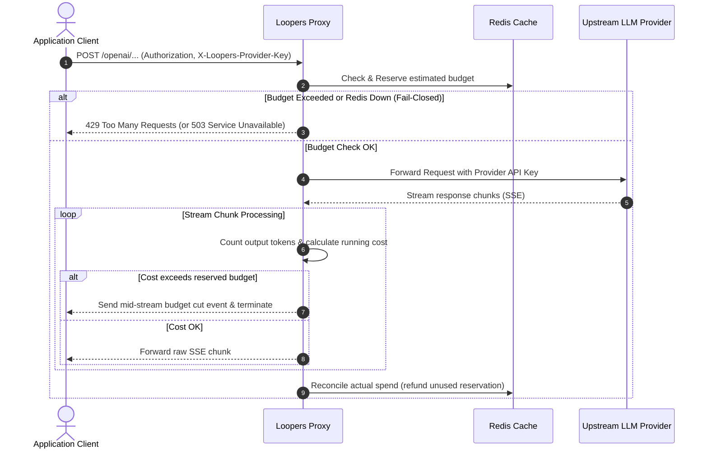

# Architecture Overview

Loopers is engineered specifically as a high-performance infrastructure-level circuit breaker. It acts as a transparent reverse proxy between your application clients and the upstream LLM providers.

## System Components

1. **Application Client**: Your agent, service, or script making the API call. It interacts with Loopers using the standard OpenAI/Anthropic/etc. client SDKs, simply pointing the base URL to the Loopers instance.
2. **Loopers Proxy**: The core engine written in Go. It handles request interception, real-time token counting, and budget enforcement. It adds minimal latency (~1-2ms) and is completely stateless regarding API keys.
3. **Redis Cache**: Used for atomic budget reservation and transaction management. Loopers executes checks in a single Redis Lua transaction, preventing Time-of-Check to Time-of-Use (TOCTOU) race conditions under high concurrency.
4. **Upstream LLM Provider**: The actual AI provider (OpenAI, Anthropic, Gemini, etc.) that processes the request and streams the response.

## Request Flow

### Key Security Guarantees
- **Zero-Storage Pass-Through**: Your actual provider API keys are only kept in-memory during the request lifecycle and are never persisted to disk or a database.
- **Fail-Closed Guarantee**: If the Redis cache or proxy goes down, it fails closed to instantly protect your budget.
- **Atomic Concurrency Control**: Budget checks happen via Lua scripts, ensuring that 1,000 parallel requests won't accidentally bypass the limit.
