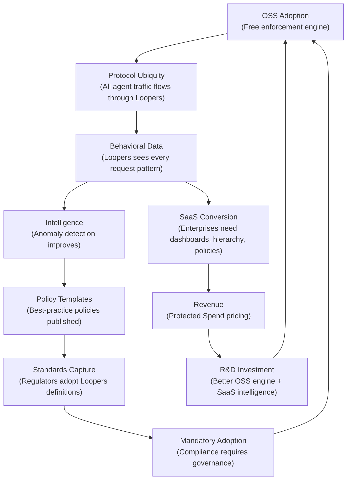

# The Holy Grail: Loopers Master Strategy v2.0

**Document Classification:** Internal — Founder Eyes Only
**Last Updated:** July 18, 2026
**Version:** 2.1

> [!CAUTION]
> **Critical Change from v1.0:** The SaaS is **not** the OSS with extra features bolted on. The OSS and SaaS are architecturally separate systems with separate codebases, separate CI/CD pipelines, and a zero-trust boundary between them. A vulnerability in the publicly auditable OSS code must have **zero exploitability** against the SaaS infrastructure.

---

## Table of Contents

1. [The Category We Are Creating](#1-the-category-we-are-creating)
2. [The Complete ARG Stack — 6 Layers](#2-the-complete-arg-stack--6-layers)
3. [The 5-Year Market Timeline](#3-the-5-year-market-timeline)
4. [Competitive Kill Chart](#4-competitive-kill-chart)

**--- SECTION A: THE OSS PRODUCT ---**

5. [OSS Mission & Scope](#5-oss-mission--scope)
6. [OSS Technical Architecture](#6-oss-technical-architecture)
7. [OSS Roadmap — Layer-by-Layer](#7-oss-roadmap--layer-by-layer)

**--- SECTION B: THE SAAS PRODUCT ---**

8. [SaaS Mission & Scope](#8-saas-mission--scope)
9. [SaaS Technical Architecture](#9-saas-technical-architecture)
10. [SaaS Roadmap — Layer-by-Layer](#10-saas-roadmap--layer-by-layer)

**--- THE BOUNDARY ---**

11. [The Zero-Trust Boundary: Why OSS ≠ SaaS](#11-the-zero-trust-boundary-why-oss--saas)
12. [The Business Model — "Protected Spend" Pricing](#12-the-business-model--protected-spend-pricing)
13. [The Dominance Flywheel](#13-the-dominance-flywheel)
14. [What Loopers Must Never Do](#14-what-loopers-must-never-do)
15. [Zero Standing Privileges (ZSP) & Agent-to-Agent (A2A) Governance](#15-zero-standing-privileges-zsp--agent-to-agent-a2a-governance)

---

## 1. The Category We Are Creating

### The Name: **Agent Runtime Governance (ARG)**

No one owns this category today. LiteLLM sells routing. Portkey sells observability. LangSmith sells tracing. None of them sell **guarantees**.

Loopers will define Agent Runtime Governance as:

> *The mandatory infrastructure layer that provides cryptographic guarantees of bounded behavior — financially, operationally, and security-wise — for every autonomous AI agent in production.*

This is not a proxy. This is not a dashboard. This is the **firewall for the agentic era**.

### Why This Category Will Exist

| Force | Evidence (June 2026) | Implication |
|---|---|---|
| **Catastrophic Agent Incidents** | $8K–$50K weekend runaway bills are routine. GitHub paused Copilot signups (April 2026) because agentic workloads overwhelmed infrastructure. | Enterprises need kill-switches, not dashboards. |
| **Regulatory Mandate** | EU AI Act high-risk obligations enforceable August 2, 2026. NIST launched AI Agent Standards Initiative (Feb 2026). Agent Control Standard (ACS) published May 2026. | Governance tools become compliance requirements. |
| **MCP Standardization** | MCP has 97M+ monthly SDK downloads, 10,000+ servers, 28% Fortune 500 adoption. But MCP was designed for capability, not defense — tool poisoning, prompt injection, and data exfiltration are documented threats. | A standardized interception point exists, and it desperately needs a governance layer. |
| **The OWASP Agentic AI Top 10** | ASI01–ASI10 published, covering Goal Hijack, Tool Misuse, Identity Abuse, Supply Chain, Code Execution, Memory Poisoning, Insecure Inter-Agent Comms, Cascading Failures, Trust Exploitation, Rogue Agents. | The threat taxonomy is now formalized. Enterprise security teams have a checklist — and need tools to satisfy it. |

### The Market Size

| Metric | AI Agents Market | AI Governance Market |
| :--- | :--- | :--- |
| **2026 (Current)** | ~$7–10B | ~$1.5–2B |
| **CAGR** | ~43–47% | ~35–50%+ |
| **2030 Projection** | $46B–$53B | $5.6B–$7.4B |

> [!IMPORTANT]
> By 2027, 60% of enterprises are predicted to experience an AI governance failure. 40% of agentic AI projects will be cancelled due to weak risk controls. Every one of those failures is a Loopers customer waiting to happen.

---

## 2. The Complete ARG Stack — 6 Layers

Based on verified industry research (OWASP, NIST, CSA, ACS), the complete ARG platform comprises six functional layers. Each layer builds on the one below it.

| Layer | Name | Purpose | Loopers Owner |
| :--- | :--- | :--- | :--- |
| **1** | Identity & Authentication | Establish *who* the agent is | OSS + SaaS |
| **2** | Policy & Decision Engine | Define *what* the agent is allowed to do | OSS (local) + SaaS (fleet) |
| **3** | Execution & Interception | Physically intercept every action | **OSS (core strength)** |
| **4** | Observability & Traceability | Capture "decision provenance" — the *why* | OSS (export) + SaaS (analysis) |
| **5** | Operational & Resource Mgmt | Protect infrastructure and budgets | **OSS (core strength)** |
| **6** | Compliance & Attestation | Generate verifiable proof of governance | **SaaS only** |

---

## 3. The 5-Year Market Timeline

| Year | Milestone | Loopers Response |
| :--- | :--- | :--- |
| **2026** | EU AI Act enforced. ACS published. OWASP ASI01–ASI10 formalized. | **Ship OSS v1** with Layers 3+5 hardened. Be the definitive MCP Security Proxy. |
| **2027** | 60% governance failures. Demand spike. AI talent scarcity peaks. | **Ship SaaS v1** with fleet dashboard, centralized policy push, and decision provenance UI. |
| **2028** | 33% of enterprise apps include agentic AI. 15% of daily decisions autonomous. | **Scale the SaaS.** Multi-agent governance. A2A protocol mediation. Marketplace for policy packs. |
| **2029** | AI-to-AI collaboration normalizes. Self-improving agents emerge. | **"Loopers Verified" certification** becomes an industry standard for agent security. |
| **2030** | AI governance market exceeds $5B+. AI performance ROI is a board-level metric. | **Category leadership.** Foundation donation. Insurance partnerships. Standards body influence. |

---

## 4. Competitive Kill Chart

| Company | What They Do | Why Loopers Wins |
| :--- | :--- | :--- |
| **LiteLLM** | Python LLM router with post-call budget tracking | Post-call = after the money is spent. Loopers does pre-call atomic reservation. 25x throughput, 0% leakage. |
| **Bifrost** | Go AI gateway with MCP tool filtering | Policy-based, not cost-based. No atomic budget per tool call. No fail-closed guarantee. |
| **Lasso Security** | Shadow AI discovery, prompt firewalling | Prompt-layer only. No tool-call interception, no policy engine, no identity plane. |
| **CalypsoAI** | Enterprise GenAI governance, PII masking | Application-plane (Rung 4). If the agent is compromised, CalypsoAI's guardrails go with it. |
| **GuardionAI** | Sub-50ms runtime inspection of tool calls | Closest competitor architecturally. But no OSS community wedge. No data flywheel. |
| **Zenity** | Build-time to runtime governance | Strong but closed-source. Cannot replicate OSS adoption flywheel. |
| **Portkey/Palo Alto** | Unified AI control plane (acquired) | Now a feature in Prisma Cloud. Enterprise sales cycles. Not a standalone category leader. |

> [!TIP]
> **Loopers' kill shot across all competitors:** An open-source, framework-agnostic, out-of-process proxy that achieves **Rung 5 (Two-Plane Verified)** on the Enforceability Ladder. No competitor offers this combination. Most are stuck at Rung 4 (application-plane enforced).

---

# SECTION A: THE OSS PRODUCT

## 5. OSS Mission & Scope

### Mission
> Make Loopers OSS the most adopted agent governance engine on the planet. Solve an immediate, painful problem — runaway costs, infinite loops, unauthorized tool execution — for every developer running AI agents.

### What OSS Is
The OSS is the **Data Plane** — the enforcement muscle that sits in the hot path. It must be:
- **Trustworthy:** Fully auditable, MIT-licensed, forkable.
- **Self-contained:** Works perfectly with zero external dependencies beyond Redis.
- **Fast:** Sub-millisecond overhead on the hot path.
- **Fail-closed:** If Loopers goes down, agents stop. Not the other way around.

### What OSS Is NOT
- ❌ A crippled demo of the SaaS.
- ❌ A library imported by the SaaS.
- ❌ A codebase that shares auth, session, or tenant logic with the SaaS.

### OSS Boundary Map

| Capability | In OSS? | Rationale |
|---|:---:|---|
| Core Proxy Engine (Go + `httputil.ReverseProxy`) | ✅ | Must be auditable and trusted. |
| Atomic Lua Budget Enforcement (Redis) | ✅ | Core value prop. |
| Fail-Closed Guarantee | ✅ | Security property, must be verifiable. |
| Mid-Stream SSE Cutoff | ✅ | Core circuit-breaking. |
| Loop Detection (Fingerprint, Velocity, Stall) | ✅ | Builds community trust. |
| MCP Tool-Call Interception (JSON-RPC 2.0) | ✅ | Drives MCP ecosystem adoption. |
| Tool-Call Circuit Breaking (exact-match) | ✅ | Safety-critical, auditable. |
| Frequency Limiting / Blast-Radius Bounds | ✅ | Extends the wedge beyond dollars. |
| Session TTL / Tool Invocation Caps | ✅ | Deterministic circuit breakers. |
| Local Policy Enforcement (OPA/Rego from file) | ✅ | Makes OSS genuinely useful for governance, not just cost control. |
| Basic Agent Identity (local API key issuance) | ✅ | Foundational for any policy enforcement. |
| OpenTelemetry Export (GenAI conventions) | ✅ | Rich data generation. "Bring Your Own Backend." |
| Prometheus Metrics | ✅ | Standard observability, table stakes. |
| Helm Chart + Docker Compose | ✅ | Self-hosted deployment. |

---

## 6. OSS Technical Architecture

```
┌──────────────────────────────────────────────────┐
│                   Loopers OSS                     │
│          (MIT License, separate repo)             │
│                                                    │
│  ┌─────────────────────────────────────────────┐  │
│  │            Proxy Engine (Go)                 │  │
│  │  - httputil.ReverseProxy                     │  │
│  │  - MCP JSON-RPC 2.0 Interception             │  │
│  │  - HTTP/REST/SSE Interception                │  │
│  │  - Fail-Closed Circuit Breaker               │  │
│  └──────────────┬──────────────────────────────┘  │
│                 │                                  │
│  ┌──────────────▼──────────────────────────────┐  │
│  │         Enforcement Engine                   │  │
│  │  - Redis Lua Atomic Budget Checks            │  │
│  │  - Loop Detection (Ring, Velocity, Stall)    │  │
│  │  - Frequency Limiter / Blast-Radius Bounds   │  │
│  │  - Session TTL / Tool Invocation Caps        │  │
│  └──────────────┬──────────────────────────────┘  │
│                 │                                  │
│  ┌──────────────▼──────────────────────────────┐  │
│  │         Local Policy Engine                  │  │
│  │  - OPA/Rego policy files loaded from disk    │  │
│  │  - Basic agent identity (lp-xxx key auth)    │  │
│  │  - Default-deny evaluation                   │  │
│  └──────────────┬──────────────────────────────┘  │
│                 │                                  │
│  ┌──────────────▼──────────────────────────────┐  │
│  │         Telemetry Exporter                   │  │
│  │  - OpenTelemetry OTLP (GenAI conventions)    │  │
│  │  - Prometheus /metrics                       │  │
│  │  - Structured JSON debug logs                │  │
│  └─────────────────────────────────────────────┘  │
│                                                    │
│  Zero-Storage Architecture: No API keys, request   │
│  bodies, or response bodies are persisted to disk. │
└──────────────────────────────────────────────────┘
```

---

## 7. OSS Roadmap — Layer-by-Layer

### Phase 1 (Now → 6 months): Fortify the Wedge

| Status | Layer | Deliverable | Detail |
|:---:|---|---|---|
| ✅ DONE | **L5** | Blast-Radius Circuit Breakers | Add frequency limiting (API calls/min), tool invocation caps (max calls/session), session TTL, and blast-radius bounds (max external systems/session). |
| ✅ DONE | **L3** | MCP Security Proxy | Harden MCP interception. Filter server-provided metadata to prevent tool poisoning. Implement ACS-compliant hooks. Become the definitive "MCP Security Proxy." |
| ✅ DONE | **L4** | GenAI OTel Exporter | Upgrade OTel exporter to use `gen_ai.*` semantic conventions. Generate span hierarchies, decision provenance attributes, and evidence attachment. |
| 🚫 CANCELLED | **L5** | Benchmark Series v2 | Head-to-head benchmarks vs. Bifrost and GuardionAI. (Cancelled due to technical mismatches). |

### Phase 2 (6–12 months): Build the Brain (Local)

| Status | Layer | Deliverable | Detail |
|:---:|---|---|---|
| ✅ DONE | **L1** | Basic Agent Identity | Local API key issuance with per-key metadata (agent name, owner, allowed tools, budget). Foundational for all policy enforcement. |
| ✅ DONE | **L2** | Local OPA/Rego Integration | Load policy files from disk. PEP (proxy) queries PDP (embedded OPA). Default-deny. GitOps-friendly. |
| ❌ TODO | **L1** | ZSP Identity (JWKS/JWT) | Statelessly verify short-lived OIDC delegation JWTs for agent identity instead of static keys. |
| ❌ TODO | **L3** | A2A Protocol Mediation | Intercept Agent-to-Agent communication. Enforce that cascading agent calls respect the original session's policies. |
| ✅ DONE | **L3** | Framework Adapters | First-class integrations: LangChain, CrewAI, AutoGen, LlamaIndex, Semantic Kernel. One-line setup. |

---

# SECTION B: THE SAAS PRODUCT

## 8. SaaS Mission & Scope

### Mission
> Become the control plane that every enterprise with 10+ agents needs. Sell to CISOs, platform teams, and compliance officers. Monetize through fleet management, advanced analytics, and compliance artifacts.

### What SaaS Is
The SaaS is the **Control Plane** — the intelligence layer that manages, analyzes, and proves governance at fleet scale. It is a **completely separate codebase** from the OSS.

### What SaaS Is NOT
- ❌ A hosted version of `loopers`.
- ❌ A codebase that imports or shares code with `loopers`.
- ❌ A system that trusts the OSS proxy to handle auth, identity, or tenant isolation.

### SaaS Boundary Map

| Capability | In SaaS? | Rationale |
|---|:---:|---|
| **Managed Agent Registry & NHI** (SPIFFE-compatible) | ✅ | Centralized identity issuance, rotation, and revocation across thousands of agents. |
| **Centralized Policy Fleet Management** | ✅ | GitOps UI to push OPA/Cedar policies to every Loopers proxy globally. |
| **Hierarchical Multi-Tenant Budgets** (org→team→project→key→session) | ✅ | Enterprise financial governance. Complex Redis orchestration requiring multi-tenant state. |
| **Decision Provenance Dashboard** | ✅ | SIEM-like UI visualizing agent reasoning chains, tool invocations, and policy evaluations. |
| **Algorithmic Drift Detection** | ✅ | ML over telemetry data to detect behavioral anomalies, prompt injection, and rogue agents. |
| **Dynamic AgBOM Generation** | ✅ | Real-time inventory of agent models, tools, MCP servers. EU AI Act compliance artifact. |
| **Cryptographic Action Receipts** | ✅ | Hash-linked Merkle proofs of every allow/deny decision. Offline auditor verification. |
| **Automated Compliance Reports** (EU AI Act, SOC 2, NIST AI RMF) | ✅ | One-click PDF/JSON reports mapping agent activity to regulatory articles. |
| **Behavioral Anomaly Engine** | ✅ | Statistical models trained on aggregate customer data. Cross-customer threat intelligence. |
| **SIEM Integrations** (Palo Alto XSIAM, Splunk, CrowdStrike, Sentinel) | ✅ | Native event emission for enterprise security stacks. |
| **Team Management + RBAC + SSO/SAML** | ✅ | Enterprise auth and access control. |
| **"Loopers Verified" Certification** | ✅ | Certification program for frameworks and enterprises. |
| **Policy Marketplace** | ✅ | Third-party policy packs (HIPAA, SOC2, PCI-DSS). |

---

## 9. SaaS Technical Architecture

```
┌─────────────────────────────────────────────────────────────┐
│                    Loopers Cloud (SaaS)                       │
│         (CLOSED SOURCE — separate repo, separate CI/CD)       │
│                                                               │
│  ┌─────────────────────────────────────────────────────────┐ │
│  │              Multi-Tenant Control Plane                  │ │
│  │                                                          │ │
│  │  - Tenant Isolation Layer (per-tenant encryption keys)   │ │
│  │  - Agent Registry & NHI (SPIFFE-compatible issuance)     │ │
│  │  - Centralized Policy Engine (OPA/Cedar fleet push)      │ │
│  │  - Hierarchical Budget Orchestrator                      │ │
│  │  - Decision Provenance Dashboard API                     │ │
│  │  - Drift Detection ML Engine                             │ │
│  │  - AgBOM Generator                                       │ │
│  │  - Compliance Report Engine                              │ │
│  │  - Cryptographic Receipt Store                           │ │
│  │  - RBAC + SSO/SAML Engine                                │ │
│  │                                                          │ │
│  │  Auth: OAuth 2.0 / OIDC (dashboard)                     │ │
│  │        mTLS (service-to-service)                         │ │
│  │        Per-tenant Redis isolation                        │ │
│  └──────────────┬──────────────────────────────────────────┘ │
│                 │                                             │
│                 │  Hardened gRPC Interface Contract            │
│                 │  (Zero trust. Authenticated. Encrypted.     │
│                 │   The SaaS NEVER trusts the proxy.)         │
│                 │                                             │
│  ┌──────────────▼──────────────────────────────────────────┐ │
│  │   Loopers Enforcement Engine                             │ │
│  │   (REIMPLEMENTED — NOT the OSS binary)                   │ │
│  │                                                          │ │
│  │   The SaaS contains its OWN hardened enforcement         │ │
│  │   engine. It may share algorithmic concepts with the     │ │
│  │   OSS (e.g., Lua budget scripts) but the codebase is    │ │
│  │   separate, with additional:                             │ │
│  │   - Multi-tenant request routing                         │ │
│  │   - Tenant-scoped key validation                         │ │
│  │   - Hardened input sanitization                          │ │
│  │   - Internal audit trail emission                        │ │
│  │   - Action receipt generation                            │ │
│  └─────────────────────────────────────────────────────────┘ │
│                                                               │
│   Zero shared code with loopers for:                      │
│   - Authentication / session management                       │
│   - Key validation                                            │
│   - Tenant routing                                            │
│   - Any code path that handles untrusted input                │
└─────────────────────────────────────────────────────────────┘
```

> [!WARNING]
> **The SaaS enforcement engine is NOT a vendored import of `loopers`.** It is a reimplemented, hardened version in a private repository. It may use the same Redis Lua budget algorithm (proven correct), but all surrounding Go code — request parsing, key validation, error handling, logging — is written independently with SaaS-specific hardening (input sanitization, tenant isolation, rate limiting on the control plane itself).

---

## 10. SaaS Roadmap — Layer-by-Layer

### Phase 1 (Month 6–12): SaaS v1 Launch

| Layer | Deliverable | Detail |
|---|---|---|
| **L1** | Managed Agent Registry | Centralized dashboard for issuing, rotating, and revoking agent identities. SPIFFE-compatible credential format. |
| **L2** | Centralized Policy Push | GitOps UI for writing and deploying OPA/Cedar policies across all connected proxies. |
| **L4** | Decision Provenance Dashboard | Ingest OTel traces from OSS proxies. Visualize agent reasoning chains and policy evaluations. |
| **L5** | Hierarchical Budgets | org→team→project→key→session budget hierarchy with real-time spend aggregation. |
| **—** | "Protected Spend" Billing | Launch the pricing model. |

### Phase 2 (Month 12–24): Enterprise Hardening

| Layer | Deliverable | Detail |
|---|---|---|
| **L4** | Algorithmic Drift Detection | ML models trained on aggregated telemetry. Detect behavioral anomalies, prompt injection patterns, and rogue agents. |
| **L6** | AgBOM Generation | Auto-generate dynamic Agent Bills of Materials for every registered agent. Export to CycloneDX/SPDX. |
| **L6** | Cryptographic Action Receipts | Hash-linked Merkle proofs for every allow/deny decision. Offline auditor verification. |
| **L6** | Automated Compliance Reports | One-click EU AI Act, NIST AI RMF, and SOC 2 mapping reports. |
| **—** | SIEM Integrations | Native emission to Palo Alto XSIAM, Splunk, CrowdStrike Falcon, Microsoft Sentinel. |

### Phase 3 (Month 24–36): Category Dominance

| Layer | Deliverable | Detail |
|---|---|---|
| **—** | "Loopers Verified" Certification | Certification program for agent frameworks and enterprises. |
| **—** | Policy Marketplace | Third-party policy packs (HIPAA, SOC2, PCI-DSS) sold through the SaaS. |
| **—** | Insurance Partnerships | Cyber insurance providers use Loopers' audit trail as proof-of-governance for premium reduction. |
| **—** | Loopers Foundation | Donate the OSS core to CNCF/Linux Foundation. Prevent license controversies. Cement community standard. |

---

## 11. The Zero-Trust Boundary: Why OSS ≠ SaaS

### The Threat Model

```
1. Attacker clones loopers repository
2. Uses frontier AI models (Claude, GPT-5, Gemini) to perform automated code audit
3. Discovers vulnerability in request parsing, key validation, or Lua scripts
4. Attempts to exploit the same vulnerability in Loopers Cloud
5. FAILS — because the SaaS does not use the OSS codebase for these paths
```

As of June 2026, AI-driven exploit tools can autonomously scan codebases, trace data paths, and generate functional exploit code. Median time from vulnerability disclosure to exploitation has collapsed to under 5 days. For OSS-to-SaaS attacks, there is no disclosure — the attacker finds it themselves.

### The Five Rules of Separation

#### Rule 1: Separate Codebases
- `loopers`: Public GitHub repo. MIT license. Community contributions.
- `loopers-cloud`: Private repo. Closed source. Separate CI/CD. Separate team access.
- **Zero `import` or `go mod require` from `loopers` in `loopers-cloud`.**

#### Rule 2: Zero Shared Auth or Session Code
- OSS: Simple bearer tokens (`lp-xxx`) validated against Redis hashes. In the future: Verification of statelessly issued JWTs.
- SaaS: OAuth 2.0/OIDC for dashboard. mTLS for service-to-service. Per-tenant encryption keys. Token minting.
- An exploit against `internal/keyring/` has **zero applicability** to SaaS auth because they share zero code.

#### Rule 3: The SaaS Never Trusts the OSS Proxy
When an enterprise connects their self-hosted OSS proxy to the SaaS control plane:
- The SaaS treats the OSS proxy as an **untrusted client**.
- All communication is authenticated (mTLS), encrypted, and rate-limited.
- The SaaS independently validates every telemetry event, policy request, and budget report the proxy sends.
- The proxy has **zero access** to the control plane database (policies, user accounts, billing, other tenants).

#### Rule 4: Adversarial Auditing Before Every SaaS Release
1. **AI Red Team:** Run frontier models against `loopers` with explicit instructions to find exploits. Fix in OSS *before* deploying SaaS.
2. **Differential Analysis:** Automated CI/CD step comparing any shared algorithmic patterns (e.g., Lua scripts). Flag for manual review.
3. **SBOM Generation:** Track every shared dependency.

#### Rule 5: Blast Radius Containment (Assume Breach)
Even if an attacker fully compromises the enforcement engine within SaaS:
- **Tenant isolation** prevents lateral movement (per-tenant Redis keyspaces, per-tenant encryption).
- **The enforcement engine has zero access** to the control plane database.
- **Zero-Storage Architecture:** The enforcement engine persists zero API keys, request bodies, or response bodies. A full compromise yields zero customer data.

> [!IMPORTANT]
> **The Zero-Storage Architecture is your greatest security asset.** Because the enforcement path never persists sensitive data, even a complete compromise of the proxy/enforcement component yields nothing of value. This is not a feature — it is the architectural defense that makes the OSS-to-SaaS attack vector fundamentally worthless.

---

## 12. The Business Model — "Protected Spend" Pricing

### The Model
Loopers charges a percentage of the AI spend it governs, with a guaranteed savings floor.

```
Monthly Fee = max(Platform Minimum, Protected Spend × Rate)
```

### Tier Structure

| Tier | Protected Spend / Month | Rate | Platform Min | Effective Max |
|---|---|---|---|---|
| **Starter** | $0 – $10K | 3.0% | $0 (free) | $300 |
| **Growth** | $10K – $100K | 1.5% | $150/mo | $1,500 |
| **Enterprise** | $100K – $1M | 0.8% | $800/mo | $8,000 |
| **Scale** | $1M+ | 0.4% | Custom | Custom |

### Revenue Projection

| Year | Customers | Avg Protected Spend | Avg Rev/Customer | ARR |
|---|---|---|---|---|
| Year 1 | 50 | $50K/mo | $750/mo | $450K |
| Year 2 | 300 | $80K/mo | $1,200/mo | $4.3M |
| Year 3 | 1,500 | $150K/mo | $1,800/mo | $32.4M |

### The Lock-In Mechanism
Once an enterprise writes 200 OPA/Rego policies in Loopers Cloud, configures hierarchical budgets across 50 teams, and builds compliance workflows around our audit reports — they are not switching. The policies and configurations become the product.

---

## 13. The Dominance Flywheel



### The Conversion Trigger
When an organization has 10+ OSS proxies across multiple environments and cannot answer:
- "What is our total agent spend?"
- "Did any agent access unauthorized tools this week?"
- "Can we prove to auditors that governance was active?"

...they buy the SaaS.

---

## 14. What Loopers Must Never Do

### 1. Never Build an LLM Router
Don't add model fallback, load balancing, or routing to the OSS core. That's LiteLLM and Bifrost's game. Loopers sits *alongside* routers. The existing budget-aware fallback in `server.go` is acceptable (falling back to a cheaper model when budget is exhausted), but general-purpose routing must never be added.

### 2. Never Build a Dashboard in OSS
The dashboard is a SaaS feature. The enforcement engine is the OSS product. If the dashboard goes down, agents are still protected. If the engine goes down, agents are blocked (fail-closed). The dashboard is glass; the engine is steel.

### 3. Never Compromise the Zero-Storage Guarantee
The moment Loopers persists an API key, request body, or response body to disk, the entire security narrative collapses. Every new feature must be validated against this constraint.

### 4. Never Sacrifice Latency for Intelligence
Sub-millisecond proxy overhead is a hard benchmark. Any feature adding >2ms to the hot path must be optional and off-by-default. Behavioral detection runs asynchronously. Policy evaluation is cached. The proxy path is sacred.

### 5. Never Import OSS Code into the SaaS
The SaaS must never `import` or `require` the OSS Go module. Shared algorithmic concepts (e.g., the Lua budget scripts) may be reimplemented, but the surrounding code — request parsing, input sanitization, auth, error handling — must be written independently. A vulnerability in `loopers` must have zero exploitability against `loopers-cloud`.

### 6. Never Open-Source the Intelligence Layer
Behavioral models, cross-customer threat intelligence, anomaly detection algorithms, drift detection ML — these are the SaaS moat. Open-sourcing them gives away the only thing competitors cannot replicate: intelligence trained on aggregate enforcement data.

---

## 15. Zero Standing Privileges (ZSP) & Agent-to-Agent (A2A) Governance

As the AI agent landscape matures, security must shift from static, long-lived credentials to Zero Standing Privileges (ZSP) and dynamic context mediation. To retain category dominance, Loopers OSS implements the execution-layer controls for this architecture, while leaving the management, scaling, and auditing complexities to Loopers Cloud.

This evolution tightly couples with the 6-Layer Stack (Section 2) and acts as the bridge connecting Identity, Execution, and Compliance:
- **Layer 1 (Identity)** moves from static API keys to ephemeral, cryptographically bound JWTs.
- **Layer 2 (Policy)** gains context-aware escalation paths.
- **Layer 3 (Interception)** mediates Agent-to-Agent (A2A) trust handoffs.
- **Layer 6 (Compliance)** gains irrefutable proof of delegation via token chains.

### 1. ZSP OIDC Verification (Layer 1 - Identity)
Rather than managing static API keys (`lp-xxx`), Loopers OSS shifts to verifying ephemeral, short-lived Agent Delegation JWTs minted by an identity authority (SaaS Control Plane or Okta/Entra ID).
- **Signature Verification:** The OSS proxy statelessly verifies incoming JWT signatures using a cached JWKS endpoint.
- **Latency Guarantee:** Cryptographic token checks run in under 150 microseconds, preserving the sub-millisecond hot path.
- **DPoP Token Binding:** The proxy enforces Demonstrating Proof-of-Possession (RFC 9449), validating that the token cannot be replayed even if an agent host is completely compromised.
- **Fail-Closed Constraint:** If JWKS lookup fails or the JWT signature is invalid, the proxy aborts the request immediately.

### 2. Dynamic Consent Escalation (Layer 2 & Layer 3)
Under ZSP, agents start with least privileges. When an agent attempts an action that exceeds its active scope (e.g., spending over budget, invoking an unapproved tool):
- **Proxy Interception (L3):** The OSS proxy suspends the HTTP/MCP request mid-flight and publishes a JIT (Just-in-Time) escalation event to Redis/NATS.
- **Asynchronous Resumption:** The proxy holds the request open while waiting for the SaaS approval broker (Control Plane) to notify a human and confirm permission upgrade. If approved, the proxy resumes execution. If denied, it terminates the request cleanly.

### 3. Agent-to-Agent (A2A) Protocol Mediation (Layer 3 & Layer 6)
When an agent autonomously delegates a task to another agent, execution context and budgets are easily lost.
- **Delegation Propagation:** Loopers OSS intercepts inter-agent communications and ensures downstream calls carry the parent agent's cryptographically linked delegation chain.
- **Unified Budget Caps:** Downstream tool executions are dynamically charged against the parent session's budget limits. The OSS verifies these boundaries statelessly via its Redis Lua engine.
- **Compliance Proofs (L6):** The SaaS platform uses these nested token chains to generate cryptographically verifiable Action Receipts, proving to auditors exactly which human or parent agent delegated the authority for any action.

### 4. Codebase Boundary for ZSP
Consistent with the Zero-Trust Boundary (Section 11):
- **OSS (Data Plane):** Implements JWT parsing, JWKS caching, DPoP validation, and request suspension. It trusts nothing except the mathematical signature of the tokens.
- **SaaS (Control Plane):** Implements human-in-the-loop workflows, UI dashboards for JIT approval, OIDC token minting, and identity federation.

---

> *"You will run agents from Salesforce, Microsoft, and your own homegrown stack. They will all be governed by one independent, unbypassable, and auditable control plane utilizing Two-Plane Verified architecture. That control plane is Loopers."*

---

**End of Document.**
